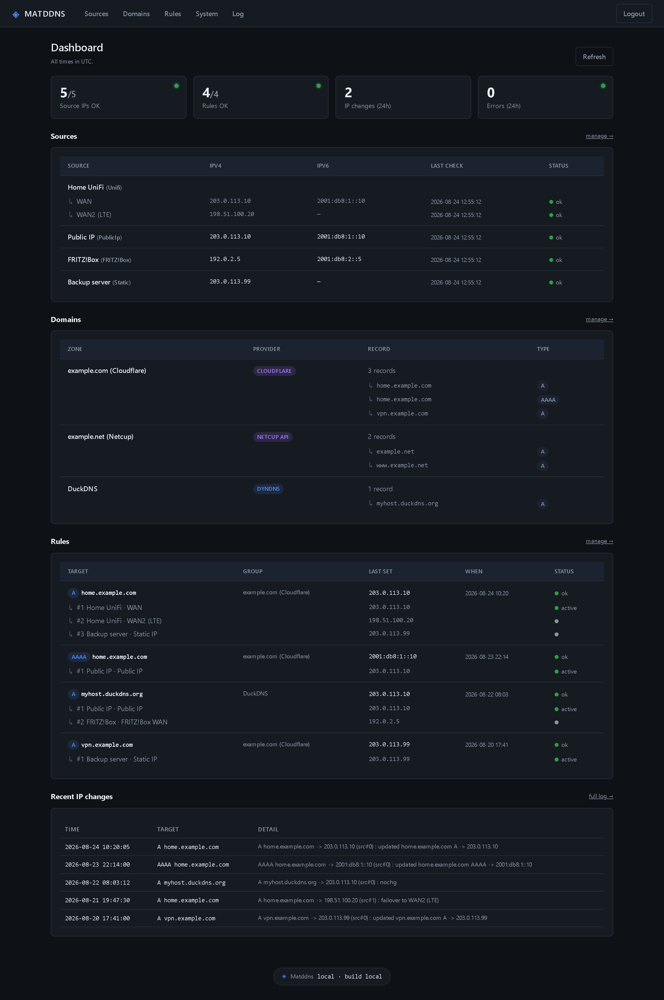
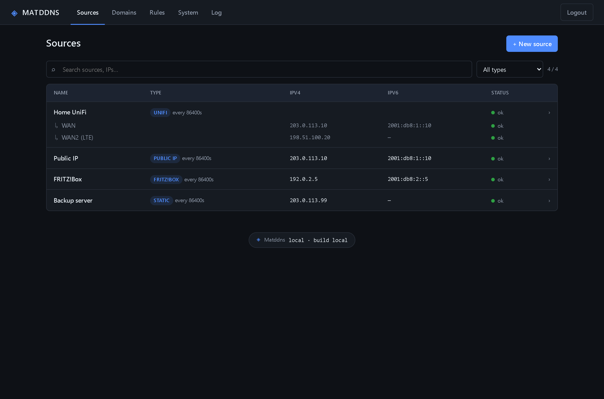
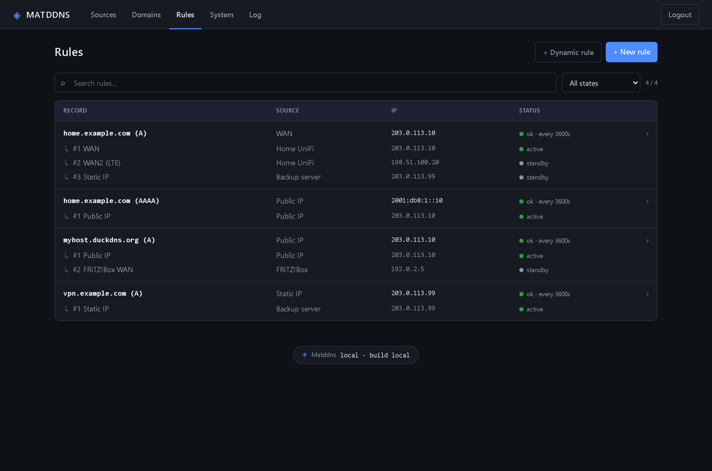
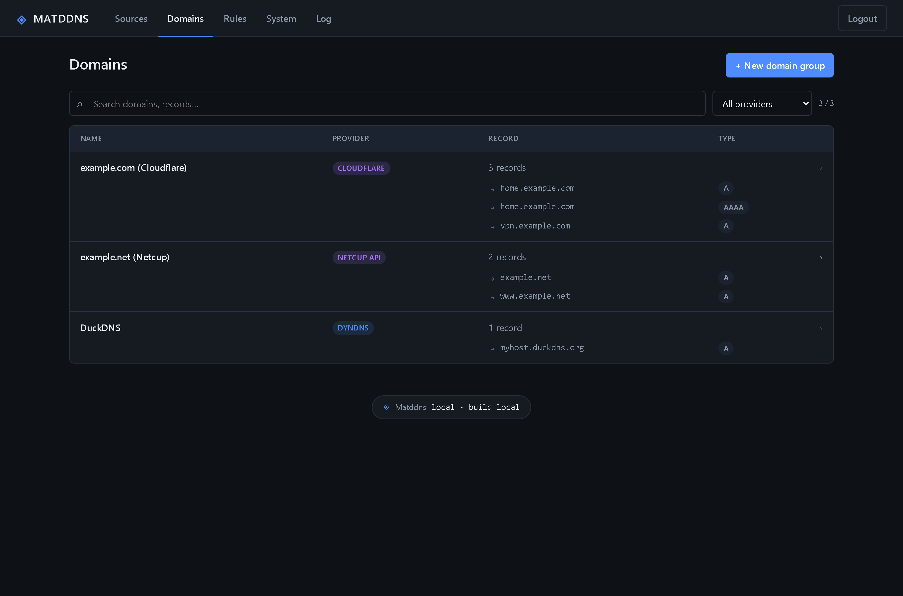
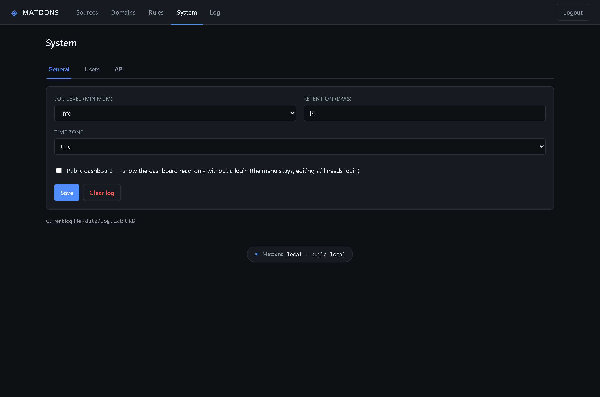

<div align="center">


# Matddns

**A universal DynDNS updater with a web UI.**

Pull an IP from many sources – your public IP, UniFi WANs, a FRITZ!Box, a DNS name,
a static value or a value pushed in – and keep your DNS records in sync, with failover
to the first reachable source. One container, no cloud, no third-party services.

[](https://github.com/Real-TTX/Matddns/actions/workflows/docker-publish.yml)
[](https://github.com/Real-TTX/Matddns/pkgs/container/matddns)


</div>



---

## What this is about

The DynDNS client on a router updates one provider with one IP. Matddns sits in the middle:
several IP **sources**, several DNS **targets**, and **failover rules** that move a record onto
the next reachable source when a WAN goes down. Everything is configured in a web UI, with a
dashboard and a monitoring API on top – and it can also *receive* updates, so a router can push
its IP into Matddns just like it would to any DynDNS provider.

## At a glance

**Sources – where an IP comes from**
- The container's own **public IPv4/IPv6**
- **UniFi** UDM/UGW WANs read locally from the controller (incl. LTE failover), or from the
  **UniFi Site Manager cloud** (one key, pick the gateways)
- A **FRITZ!Box** over TR-064 (locally via `fritz.box`, or remotely via MyFRITZ!)
- A **DNS lookup** of any hostname → its A/AAAA
- A **static** value you type in
- A **pushed-in** value (DynDNS server, see below)
- Another **Matddns peer** (pull over its JSON API)

**Targets – where an IP is written**
- The **Cloudflare**, **Netcup**, **Hetzner DNS** and **GoDaddy** APIs (record + zone,
  A/AAAA/CNAME, optional create-on-demand)
- Another **Matddns peer** (push over its JSON API)
- Generic **DynDNS update URLs** with presets for ~20 providers (DuckDNS, No-IP, Dynu,
  DynDNS.org, Strato, deSEC, DynV6, …)

**Failover, dual-stack, operations**
- **Failover rules**: a record is bound to an ordered list of sources; the first reachable wins
- **Reachability validation**: a source counts only if its IP answers a **ping** or a **TCP-port** check
- **Dual-stack**: every source carries an optional IPv4 and IPv6 (IPv6-only works too)
- **Multi-user login** with **rate-limited sign-in**, a per-install **time zone**, an adjustable
  **log level** with retention, and an optional **read-only public dashboard**
- **Monitoring API** (`/api/health`, `/api/state`) and one **.NET 8 container** with a single
  `/data` volume; CI publishes the image to GHCR on every push

## Screenshots

### Sources – every WAN and its current IP



Each source keeps its current IPv4 and IPv6. UniFi WANs (and cloud gateways) appear
automatically, one row per WAN including LTE failover.

### Rules – failover in an order you choose



A rule links one DNS record to an ordered list of sources. The first reachable one wins;
ping/TCP validation and the check interval are set per rule.

### Domains and the dashboard

| Domains | System |
|---|---|
|  |  |

Domains group your records per provider zone; System holds general settings, users and the
API docs.

## Quick start

Ready-made images are published to the GitHub Container Registry:

| Tag | Built from | Use it for |
|---|---|---|
| `ghcr.io/real-ttx/matddns:latest` | `main` | releases |
| `ghcr.io/real-ttx/matddns:0.4.<n>` | `main` | pin a specific build |

### 1. Just run it

Copy this into `docker-compose.yml` and start it – nothing else needed:

```yaml
services:
  matddns:
    image: ghcr.io/real-ttx/matddns:latest
    container_name: matddns
    restart: unless-stopped
    ports:
      - "4060:8080"
    volumes:
      - ./data:/data
    environment:
      - TZ=Europe/Berlin
    # lets the non-root user send ICMP for the "Ping" failover check
    sysctls:
      - net.ipv4.ping_group_range=0 2147483647
    healthcheck:
      test: ["CMD", "curl", "-fsS", "-o", "/dev/null", "http://localhost:8080/healthz"]
      interval: 30s
      timeout: 5s
      retries: 3
      start_period: 20s
```

```bash
docker compose up -d
```

Open **http://localhost:4060** and sign in with **`admin` / `admin`**. Change the password
under *System → Users* before exposing Matddns beyond localhost. An update is just
`docker compose pull && docker compose up -d`; the `./data` folder keeps the config, log and
session keys.

Without Compose:

```bash
docker run -d --name matddns -p 4060:8080 -v "$PWD/data:/data" \
  --sysctl net.ipv4.ping_group_range="0 2147483647" \
  ghcr.io/real-ttx/matddns:latest
```

### 2. Set up sources, targets and rules

Everything is configured in the UI – there are no files to hand-edit:

1. **Sources** → add where an IP comes from (public IP, UniFi, FRITZ!Box, …). Network sources
   fill in their current IP within a few seconds.
2. **Domains** → add a provider account and the records to keep in sync (a full FQDN plus
   type A, AAAA or CNAME; for zone-based providers a record/subdomain + zone).
3. **Rules** → bind a record to an ordered list of sources and pick the triggers (on IP change
   and/or every N seconds) and optional ping/TCP validation.

### 3. From source

```bash
docker build -t matddns:local .
docker run -d --name matddns -p 4060:8080 -v "$PWD/data:/data" matddns:local
```

or run it directly with the .NET 8 SDK:

```bash
dotnet run --project src
```

### Settings that matter

| Variable | Default | Meaning |
|---|---|---|
| `MATDDNS_ADMIN_PASSWORD` | `admin` | Initial password for `admin` on first start |
| `MATDDNS_DATA` | `/data` | Data directory (config, log, keys) |
| `MATDDNS_FORWARDED_HEADERS` | – | Set to `true` behind a TLS reverse proxy to honor `X-Forwarded-Proto`/`-For` (secure cookie + real client IP) |
| `TZ` | – | Time zone for UI timestamps (the log and `/api/*` stay UTC) |

The in-container port is `8080` (mapped to `4060` above). The UI is English throughout.

### The `/data` volume

```
/data
├─ config.json   sources, domains, rules, users, settings
├─ log.txt       application log (rotates to log.txt.1)
└─ keys/         DataProtection keys (sessions survive restarts)
```

`config.json` is written atomically and fsync'd; if it ever becomes unreadable it is preserved
as `config.json.corrupt-<timestamp>` instead of being overwritten.

## How it works

There are three building blocks.

### Sources (where an IP comes from)

| Kind | What it provides |
|------|------------------|
| Public IP | the container's own outbound IPv4/IPv6 |
| UniFi | one entry per WAN read from a local UDM/UGW (name, IPv4, global IPv6), incl. LTE failover |
| UniFi Cloud | gateways read from the UniFi Site Manager cloud API – one key, pick the gateways |
| FRITZ!Box | the WAN IPv4/IPv6 over TR-064 (locally via `fritz.box`, or via MyFRITZ!) |
| DNS lookup | resolves any hostname to its A/AAAA |
| Static IP | a fixed value you type in |
| DynDNS server | an external device pushes its IP to a token URL (see below) |
| Matddns peer | pulls the source entries of another Matddns instance over its JSON API |

Only globally routable addresses are kept – a WAN reporting a private/CGNAT or `0.0.0.0` value
is never pushed to DNS.

### Domains (where an IP is written)

| Kind | Target |
|------|--------|
| DynDNS | any provider via an update URL with `{ipv4}`, `{ipv6}`, `{hostname}`, `{user}`, `{password}` placeholders (empty ones are dropped, so one URL covers A and AAAA); presets prefill the URL |
| Netcup | the Netcup DNS API (record + zone) |
| Cloudflare | the Cloudflare API (API token with Zone.DNS edit) |
| Hetzner DNS | the Hetzner DNS API (Auth-API-Token) |
| GoDaddy | the GoDaddy DNS API (API key + secret) |
| Matddns peer | pushes the chosen IP to another Matddns instance over its JSON API |

Each entry is a single record: a full FQDN plus type A, AAAA or CNAME.

### Rules (the glue)

A rule links one record to an ordered list of source entries (the failover order). The record
type comes from the entry.

- Triggers are independent and can be combined: react on IP change (event-driven), and/or
  re-check every N seconds. A periodic re-check drives ping/TCP failover, because a source going
  down does not change its IP – so enabling a check also enforces a minimum interval.
- Validation: none, ping, or TCP port.

## Failover and validation

- **A / AAAA**: the first reachable source wins; its IP is written to the record.
- **CNAME**: the first reachable source wins; the target hostname configured per source is written.

A source counts as reachable only when its current IP passes the rule's validation:

| Validation | Needs |
|------------|-------|
| None | the source just has to have an IP |
| Ping | ICMP echo to the source IP (needs the `ping_group_range` sysctl shown above) |
| TCP port | a TCP connect to `IP:port` succeeds (no special privileges) |

A failed update is retried on the next cycle – the record is not left stranded on a stale value.

## DynDNS server (incoming)

A DynDNS-server source lets a device report its IP to a token-protected URL (shown on the
source's page, with copy-ready FRITZ!Box and UniFi examples). Both URLs take separate
`ipv4`/`ipv6` parameters; send either or both, and the other family is left untouched. Tokens
are compared in constant time, and the endpoints are rate-limited.

A **dynamic receiver** (a dynamic rule binding a DynDNS-server source to a Netcup zone) lets one
token manage many records under a namespace: the device sends `&hostname=<name>.<zone>` and that
record is created/updated on the fly (auto-create is opt-in per zone).

JSON API, for scripts and devices:

```http
GET /api/update?token=<token>&ipv4=<v4>&ipv6=<v6>
```

```jsonc
200 { "status": "ok", "changed": true, "ipv4": "…", "ipv6": "…", "time": "…" }
400 { "status": "no-ip" }
401 { "status": "unauthorized" }
```

Omit both IPs (or use the legacy auto-detecting `&ip=`) to fall back to the caller's IP.

dyndns2, for routers and FRITZ!Box (HTTP Basic auth, or `?token=` in the URL):

```http
GET /nic/update?ipv4=<v4>&ipv6=<v6>
```

This keeps the plain-text dyndns2 protocol routers expect: `good` / `nochg` / `badauth` /
`nohost`. Use `/api/update` everywhere else.

## Monitoring API

Unauthenticated JSON endpoints for monitoring software. They never expose passwords or API keys:

| Endpoint | Purpose |
|----------|---------|
| `GET /healthz` | liveness; returns `ok` while the app runs |
| `GET /api/health` | health summary: HTTP 200 when OK, 503 when degraded, plus source/rule counts |
| `GET /api/state` | full state: per-source IPs, per-rule status, recent IP changes |
| `GET /api/source?token=` | peer pull: this instance's source entries (IPs only) for a valid token |

```bash
curl http://localhost:4060/api/health   # point a monitor here and alert on a non-200 status
```

Keep Matddns on a trusted network or behind a reverse proxy; the optional public dashboard
exposes the same data as `/api/state`, nothing more.

## How it is built

- **.NET 8 / ASP.NET Core Razor Pages**, cookie auth, a hosted background updater service
- `System.Text.Json` config in `/data/config.json` (atomic + fsync'd, schema-migrated on load);
  DataProtection keys in `/data/keys`
- Passwords hashed with **PBKDF2-SHA256**; per-IP **rate limiting** on the login and push endpoints
- Docker (`mcr.microsoft.com/dotnet/aspnet:8.0`, non-root, `tzdata` for time zones)
- GitHub Actions publishing to GHCR on every push to `main`

## Versioning and schema

Release images carry a monotonic version (`0.4.<run_number>`) injected at build time; the footer
shows version, build and date. Local builds show `local · build local`.

`config.json` carries a `schemaVersion`. On startup, `ConfigService` runs every ordered migration
between the stored version and `CurrentSchemaVersion`, then stamps the new version and saves. A
fresh install starts at the current version; an older config is upgraded in place. To change the
data shape: raise `CurrentSchemaVersion`, append a `MigrateVXToVY` step (append-only), and raise
the release minor (`MAJOR_MINOR` in the CI workflow).

## License

No license file is included yet. If you intend others to reuse this, add a `LICENSE` (for
example MIT) at the repo root.
